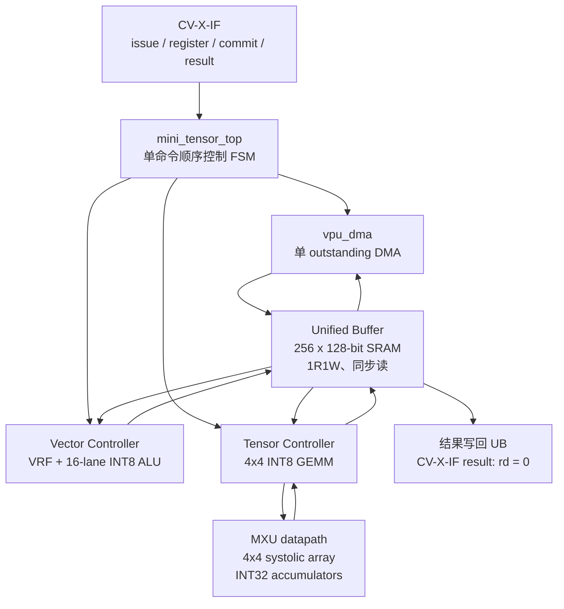

# miniTensor 微架构设计文档

## 0. 文档信息

| 项目 | 内容 |
| --- | --- |
| 设计对象 | `mini_tensor_top` RV32 外接 AI 协处理器 |
| 当前实现 | 单时钟、单命令在途、非流水顺序执行 |
| 数据通路 | 128-bit Unified Buffer（UB）+ 16-lane INT8 VPU + 4×4 INT8 GEMM |
| CPU 接口 | CV-X-IF 风格 `core_v_xif` |
| 外部内存 | 128-bit uncached read/write 握手接口 |
| 默认容量 | UB：256 行 × 128 bit（4 KiB）；VRF：32 × 128 bit |
| 文档状态 | 与当前 RTL 实现同步；未实现功能列于“限制与后续演进” |

本文描述模块边界、数据格式、时序协议、状态机和错误语义，作为 RTL、验证环境和
软件驱动之间的微架构契约。除非另有说明，文中的“行”均指一条 128-bit UB 行，
即 16 Byte。

## 1. 设计目标与非目标

### 1.1 目标

- 为 RV32 CPU 提供低成本的片上 INT8 数据搬运、向量算子和小规模矩阵乘法。
- 通过 UB 将外部内存访问与计算单元解耦，避免向量数据经过 CPU GPR。
- 使用 CV-X-IF 的 issue/register/commit/result 通道完成指令生命周期管理。
- 在 commit 之前不产生 UB 或外部内存副作用；支持结果通道 backpressure。
- 通过固定宽度和固定 Tile 形状，使仿真模型、软件打包格式和 RTL 保持一致。

### 1.2 非目标

- 当前不提供硬件 cache 一致性、cacheable/uncached alias 检测或乱序执行。
- 当前不支持多命令队列、多个 outstanding DMA、双缓冲或计算流水线。
- 当前 GEMM 仅覆盖一个 4×4×4 Tile，不包含 K 维分块累加和 Epilogue。

## 2. 顶层架构



数据方向：DMA 负责外部内存与 UB 之间搬运；Vector 和 MXU 从 UB 取数并将结果写回
UB；命令完成后，顶层通过 CV-X-IF result 通道返回标量 `rd = 0`。

### 2.1 时钟、复位与并发模型

- 所有模块共用 `clk`/`rst`；同步逻辑在上升沿更新。
- 顶层一次只保存一条已 issue 指令的 `id/hartid/rd` 和操作数。
- DMA、VPU、Tensor Controller、debug UB 读端口共享 UB 端口；顶层 FSM 保证内部
  owner 互斥。内部请求优先于 debug 读请求。
- 计算结果和 CV-X-IF result 均采用 valid/ready 语义，未握手前数据保持稳定。

## 3. RTL 模块划分

| 模块 | 微架构职责 |
| --- | --- |
| `rtl/top/mini_tensor_top.sv` | 指令解码、CV-X-IF 生命周期、操作数检查、资源编排 |
| `rtl/common/minitensor_pkg.sv` | `MT_LOAD`/`MT_STORE` 编码与构造函数 |
| `rtl/interface/core_v_xif.sv` | CV-X-IF 端口和字段定义 |
| `rtl/memory/unified_buffer.sv` | 256 行、128-bit、字节写使能的同步 SRAM 模型 |
| `rtl/memory/vpu_dma.sv` | uncached memory 与 UB 的单 outstanding 双向 DMA |
| `rtl/control/vpu_vector_controller.sv` | VRF 读、VPU ALU 调度和结果保持 |
| `rtl/vector/vpu_vector_regfile.sv` | 32 个 128-bit 向量寄存器，双读、单写 |
| `rtl/vector/vpu_vector_alu.sv` | 16 个独立 INT8 lane |
| `rtl/tensor/tensor_controller.sv` | A/B UB 读取、MXU 启动、四行 C 写回 |
| `rtl/tensor/MXU/Systolic_Array/*` | 4×4 PE 脉动阵列和 INT8×INT8→INT32 MAC |
| `rtl/tensor/MXU/INT8_GEMM/tensor_gemm_core.sv` | 固定 10-cycle GEMM 计算窗口 |

## 4. 外部接口契约

### 4.1 CV-X-IF 生命周期

```text
CPU                  miniTensor
 | issue_valid         |
 |-------------------->| 仅支持的 custom-0 指令返回 accept=1
 | register_valid      |
 |-------------------->| 提供 rs1/rs2；只接收一次
 | commit_valid        |
 |-------------------->| id/hartid 匹配且 commit_kill=0 才启动副作用
 |                     | 执行 DMA/VPU/GEMM
 | result_valid        |
 |<--------------------| rd 写回 0；err 表示非法操作数/生命周期错误
```

- `issue_ready` 仅在顶层 `S_IDLE` 拉高，因此不存在第二条命令覆盖第一条命令。
- 对不支持的 opcode/funct3，`issue_resp.accept=0`，不会进入后续阶段。
- `register` 的 `id/hartid` 必须与 issue 保存值匹配；不匹配会置 `command_err`。
- `commit_kill=1` 在副作用开始前取消命令并回到空闲态。
- 正常 commit 后命令运行至完成；result 未被 CPU 接收前，顶层停留在 `S_RESULT`。

### 4.2 外部内存接口

- Load：`mem_rd_valid/ready` 发出 16-byte 对齐地址，随后等待
  `mem_rsp_valid`；一次只允许一个未完成读请求。
- Store：`mem_wr_valid/ready` 发出 128-bit 数据和全字节写使能。
- 连续 Tile 行的外部地址每次加 16，UB 地址每次加 1。
- DMA 不维护 cache 一致性。软件必须使用 uncached 地址，禁止通过 cacheable alias
  同时访问同一缓冲区。

### 4.3 UB 接口

- 写端：`wr_en/wr_addr/wr_data/wr_be`，同步写，支持每 Byte 写使能。
- 读端：`rd_en/rd_addr` 在周期 N 采样，`rd_valid/rd_data` 在周期 N+1 返回。
- 地址越界读返回 0；越界写被抑制。顶层在指令进入执行阶段前完成范围检查。

## 5. 指令编码与数据格式

四类指令均使用 `custom-0`（opcode=`7'b0001011`）。指令完成后向 `rd` 返回标量
`0`；真正的数据结果留在 UB，不经过 CPU GPR。

### 5.1 `MT_LOAD`

| 字段 | 编码/语义 |
| --- | --- |
| `funct7/funct3` | `0000011/000` |
| `rs1` | uncached memory 源字节地址，必须 16-byte 对齐 |
| `rs2[7:0]` | UB 起始行号 |
| `rs2[15:8]` | 行数，必须非零 |
| 保留位 | `rs2[31:16]` 必须为 0 |

### 5.2 `MT_STORE`

| 字段 | 编码/语义 |
| --- | --- |
| `funct7/funct3` | `0000100/000` |
| `rs1` | uncached memory 目标字节地址，必须 16-byte 对齐 |
| `rs2[7:0]` | UB 起始行号 |
| `rs2[15:8]` | 行数，必须非零 |
| 保留位 | `rs2[31:16]` 必须为 0 |

### 5.3 Vector（`ADD8`/`MAX8`/`RELU8`）

`funct7=0000010`，`funct3` 分别为 `000/001/010`。

| 字段 | 语义 |
| --- | --- |
| `rs1[7:0]` | UB 操作数 A 行号 |
| `rs1[15:8]` | UB 操作数 B 行号 |
| `rs2[7:0]` | UB 结果行号 |
| 保留位 | `rs1[31:16]`、`rs2[31:8]` 必须为 0 |

一条 UB 行被解释为 16 个按 Byte 打包的 signed INT8 元素。`ADD8` 当前按 8-bit
结果保留；`MAX8` 和 `RELU8` 使用 signed 比较。RELU 只使用 A，但控制器仍读取 B，
以保持统一的两次同步读流程。

### 5.4 `MT_GEMM`

`funct7=0000101`、`funct3=000`，执行一个 `C = A × B` 的 4×4 signed INT8 Tile：

| 字段 | 语义 |
| --- | --- |
| `rs1[7:0]` | A 起始 UB 行（占 1 行） |
| `rs1[15:8]` | B 起始 UB 行（占 1 行） |
| `rs2[7:0]` | C 起始 UB 行，使用 `C..C+3` |
| 保留位 | `rs1[31:16]`、`rs2[31:8]` 必须为 0 |

A、B 为行主序 16×signed INT8；C 为 4 行、每行 4 个 signed INT32，按 row-major
打包到 128 bit。结果顺序为 `C[0][0] ... C[3][3]`。

## 6. 顶层状态机

`mini_tensor_top` 的主状态如下：

```text
S_IDLE -> S_WAIT_COMMIT -> S_DISPATCH
                              |
             +----------------+----------------+
             |                |                |
             v                v                v
       S_DMA_START      S_VEC_READ_A    S_TENSOR_START
             |                |                |
       S_DMA_WAIT       ...S_VEC_WAIT    S_TENSOR_WAIT
             |                |                |
             +----------------+----------------+
                              v
                         S_RESULT -> S_IDLE
```

- `S_WAIT_COMMIT`：接收一次 register，并等待匹配的 commit/kill。
- `S_DISPATCH`：检查保留位、对齐、行数和 UB 范围；失败则直接进入 `S_RESULT(err=1)`。
- DMA 路径：启动 `vpu_dma`，等待 `dma_done`。
- Vector 路径：同步读 A、同步读 B，分别装入 VRF `v1/v2`，发出内部 VPU 指令，
  等待 `v3` 结果，再写回指定 UB 行。
- Tensor 路径：启动 `tensor_controller`，等待四行结果写回完成。
- `S_RESULT`：保持 CV-X-IF result，直到 `result_valid && result_ready`。

### 6.1 DMA 子状态机

`vpu_dma` 通过以下阶段实现单 outstanding 传输：

- Load：`LOAD_REQUEST → LOAD_RESPONSE`，响应握手后写 UB，并递增地址/计数。
- Store：`STORE_UB_REQUEST → STORE_UB_WAIT → STORE_MEM_REQUEST`，等待 UB 同步读
  返回后发出 memory write。
- 最后一行完成时产生一个周期的 `done`，随后回到 `IDLE`。

### 6.2 Tensor 子状态机

`tensor_controller` 的固定流程为：

```text
READ_A -> WAIT_A -> READ_B -> WAIT_B -> CORE_START -> CORE_WAIT
       -> WRITE[0] -> WRITE[1] -> WRITE[2] -> WRITE[3] -> DONE
```

`tensor_gemm_core` 接收 A/B 后运行 10 个 `step` 周期，结果在
`result_valid` 期间保持稳定，直到 controller 接收。

## 7. 资源仲裁与一致性规则

1. 顶层 FSM 是唯一的命令 owner；命令级互斥保证 DMA/VPU/Tensor 不会同时写 UB。
2. UB 写端优先级为 `tensor_ub_wr_en`，其次为 VPU 结果写，DMA 写由命令阶段保证互斥；
   RTL 内含冲突断言。
3. UB 读端优先级为 DMA、Vector A/B、Tensor，最后才是 debug 读端口。
4. debug 读端口是只读观察通道，不参与一致性协议；建议仅在顶层空闲时使用。
5. 外部内存与 CPU cache 的一致性由软件负责，硬件不执行 flush/invalidate。

## 8. 错误、取消与 backpressure

### 8.1 非法操作数

以下任一条件失败会在 register/dispatch 阶段设置 `err`，且不发生 UB 或外部内存写入：

- DMA 地址未 16-byte 对齐、行数为 0、UB 区间越界或保留位非零。
- Vector/Tensor 行号越界或保留位非零。
- register 通道的 `id/hartid` 与 issue 保存值不匹配。

### 8.2 Kill 语义

commit kill 仅在命令产生副作用前生效。已正常 commit 的命令不会被中途撤销；
其结果仍需通过 result 通道完成。被 kill 的命令直接回到 `S_IDLE`，不会写 UB、
不会发出 DMA 请求。

### 8.3 Backpressure

- CPU 未拉高 `xif.result_ready` 时，顶层保持 `S_RESULT` 和结果字段不变。
- VPU 和 GEMM core 在 result 未握手前保持内部结果稳定。
- 外部 memory 的 ready/valid 反压只会延长 DMA 状态，不会丢失地址、数据或计数。

## 9. 性能与资源特征

| 路径 | 固定/主要开销 |
| --- | --- |
| DMA Load/Store | 每行一次外部事务；Load 另有一拍响应等待，Store 另有一拍 UB 同步读 |
| Vector | 两次 UB 同步读 + VRF 装载 + 一次 ALU 执行 + 一次结果写回 |
| GEMM | 两次 UB 同步读 + 10 个 MXU 运行周期 + 4 次 UB 结果写 |

实际总延迟由 `ready/valid` 反压、外部内存响应和 CPU result 接收时刻决定。当前实现
不重叠 DMA 与计算，也不隐藏 UB 读延迟。

## 10. 验证策略与通过标准

```sh
make sim          # 顶层 NPC + memory 闭环，等价于 make top-sim
make vector-sim   # 向量控制器与 ALU
make vrf-sim      # VRF 读写和 Byte mask
make ub-sim       # UB 同步读、写使能和越界行为
make dma-sim      # Memory <-> UB 双向 DMA
make tensor-sim   # 4x4 signed INT8 GEMM core
make regress      # 执行全部回归
```

顶层闭环应覆盖：

- `MT_LOAD → Vector → MT_STORE` 的 Memory→UB→VPU→UB→Memory 路径；
- 两次 `MT_LOAD → MT_GEMM → 四行 MT_STORE` 的 Tile 路径；
- commit 前无副作用、非法参数返回 `err`、kill 命令无写入；
- result backpressure、外部 memory backpressure 和 UB 中间结果检查；
- signed INT8/INT32 乘加的 identity 与随机黄金模型对比。

## 11. 参数与实现约束

当前实现的参数约束与默认值为：

- `DATA_WIDTH == 128`；
- `X_ID_WIDTH == 4`；
- UB 深度应至少覆盖所有已编码行号，默认 `UB_DEPTH == 256`；
- 外部 memory 地址和 DMA Tile 边界按 16 Byte 对齐。

改变数据宽度、增加 outstanding 数量或扩展 Tile 形状时，必须同步修改指令约定、
UB 仲裁、结果打包和测试平台，不能只调整单个模块参数。

## 12. 限制与后续演进

建议演进顺序：

1. 为 GEMM 增加 K 维分块累加，以及 Bias、Requant、ReLU Epilogue。
2. 引入双缓冲和多 Bank UB，使 DMA 与计算能够重叠。
3. 增加命令队列、多个 outstanding DMA 和更细粒度的 owner/仲裁协议。
4. 评估 VPU 流水线化、可配置向量长度和更丰富的饱和/舍入语义。
5. 如需 cacheable 地址，补充软件屏障或硬件一致性接口；当前 CV-X-IF 设计不包含该能力。
